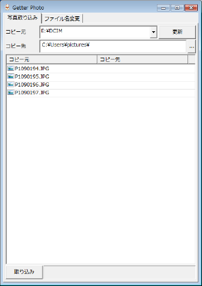

Getter Photo は、デジカメで撮影した画像ファイルをパソコンに取り込むアプリケーションです。

* 撮影日付ごとにフォルダを作成します。
* 画像ファイルを撮影日時をもとにしたファイル名にしてコピーします。

## 1. 動作環境

Windows が動作している PC を用意してください。Windows 7 で動作確認しています。それ以前のバージョン Windows XP、Vista でも大丈夫だと思いますが、Windows 8 は未確認です。

このアプリケーションを実行するには [Gura プログラミング言語](http://www.gura-lang.org/)
の環境が必要です。[ダウンロードページ](http://www.gura-lang.org/Download.html) から
Windows Installer (`gura-x.x.x-win32.msi`) をダウンロードし、インストールしてください。

## 2. インストール

パッケージファイルをダウンロードして適当なフォルダに展開します。

エキスプローラなどでスクリプトファイル `getterphoto.guraw` をダブルクリックするとプログラムが起動します。

デスクトップにアイコンを作りたい場合はスクリプトファイル `setup.guraw` を起動してください。
`[セットアップ]` ボタンをクリックするとセットアップを行います。
セットアップの詳細については [Gura アプリケーションセットアップ](../setup/) をご覧ください。

## 3. 写真取り込み

SD カードなどのメディアを PC に接続してアプリケーションを起動すると以下の画面になります。

1. `[コピー元]` でコピー元のディレクトリを選択します。
2. `[コピー先]` に「マイ ピクチャ」などのフォルダを指定してください。
3. `[取り込み]` ボタンをクリックするとコピーを開始します。

アプリケーションを起動した後でメディアを接続した場合は `[更新]` ボタンを押して
コピー元のディレクトリ一覧を更新してください。

## 4. 開発者むけ情報

このアプリケーションは GitHub レポジトリで管理されています。

URL: [https://github.com/gura-app/getterphoto.git](https://github.com/gura-app/getterphoto.git)
