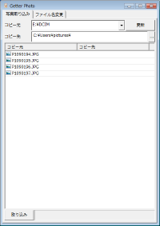

Getter Photo は、デジカメで撮影した画像ファイルをパソコンに取り込むアプリケーションです。

<table>
<tr>
<th>Windows 用

<a href="https://github.com/gura-app/{{ page.app_package }}/releases/download/v{{ page.app_version }}/{{ page.app_package }}-{{ page.app_version }}.zip"
  onClick="ga('send', 'event', 'download', 'click', '{{ page.app_package }}-{{ page.app_version }}.zip');">ダウンロード</a>
</th>
</tr>

<tr>
<td></td>
</tr>

<tr>
<td><a href="#install-windows">インストール方法</a></td>
</tr>
</table>

* 撮影日時をもとにして画像ファイル名を変更します。
* 日付ごとにフォルダを作成してファイルをコピーするので、整理がらくちん。
* 撮影日時は EXIF 情報から抽出します。

- - - - - - - - - - - - - - - - - - - - - - - - - - - - - - - - - - - - - - - - - -

1. <a href="#basic-operation">基本的な使い方</a>
2. <a href="#install-windows">インストール方法 - Windows</a>
3. <a href="#test-environment">動作確認環境</a>
4. <a href="#history">変更履歴</a>
5. <a href="#for-developers">開発者むけ情報</a>

## 1. 基本的な使い方

SD カードなどのメディアを PC に接続してアプリケーションを起動すると以下の画面になります。

1. `[コピー元]` でコピー元のディレクトリを選択します。
2. `[コピー先]` に「マイ ピクチャ」などのフォルダを指定してください。
3. `[取り込み]` ボタンをクリックするとコピーを開始します。

アプリケーションを起動した後でメディアを接続した場合は `[更新]` ボタンを押して
コピー元のディレクトリ一覧を更新してください。

## 2. インストール方法 - Windows

1. このアプリケーションを実行するには [Gura プログラミング言語](http://www.gura-lang.org/)
   の環境が必要です (無償)。
   Windows Installer `gura-x.x.x-win32.msi` (`x.x.x` はバージョン番号) を
   [ダウンロード](http://www.gura-lang.org/Download.html) し、
   インストールしてください。バージョン `0.6.2` 以降に対応しています。

2. パッケージファイル `{{ page.app_package }}-{{ page.app_version }}.zip` を
  <a href="https://github.com/gura-app/{{ page.app_package }}/releases/download/v{{ page.app_version }}/{{ page.app_package }}-{{ page.app_version }}.zip"
  onClick="ga('send', 'event', 'download', 'click', '{{ page.app_package }}-{{ page.app_version }}.zip');">ダウンロード</a> して適当なフォルダに展開します。

3. エキスプローラでスクリプトファイル `getterphoto.guraw` をダブルクリックするとアプリケーションが起動します。

4. デスクトップにアイコンを作りたい場合はスクリプトファイル `setup.guraw` を実行してください。
   `[セットアップ]` ボタンをクリックするとセットアップを行います。
   セットアップをした後は、パッケージから展開したファイルを削除してもかまいません。

   セットアップの詳細については [Gura アプリケーションセットアップ]({{ topdir }}/setup/) をご覧ください。

## 3. 動作確認環境

* **Windows** &hellip; Windows 7, Windows 8.1, Windows 10

## 4. 変更履歴

<table>
<tr><th>バージョン</th><th>リリース</th><th>変更内容</th></tr>

<tr><td>v1.0.2</td><td>2017/07/05</td><td>
Gura v0.7.0 に対応
</td></tr>

<tr><td>v1.0.1</td><td>2015/06/24</td><td>
Gura v0.6.2 に対応
</td></tr>

<tr><td>v1.0.0</td><td>2014/06/19</td><td>
1st リリース
</td></tr>

</table>

## 5. 開発者むけ情報

このアプリケーションは GitHub レポジトリで管理されています。

URL: [https://github.com/gura-app/getterphoto.git](https://github.com/gura-app/getterphoto.git)
