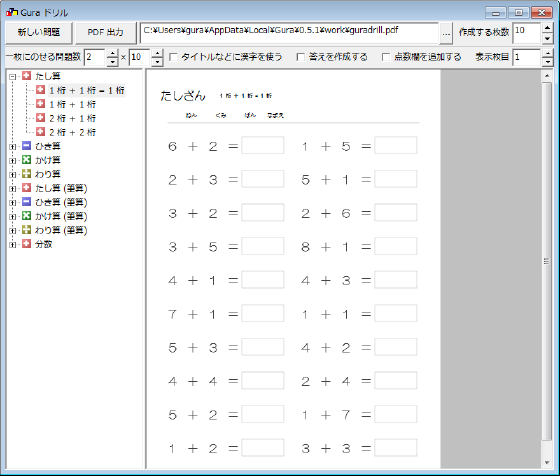



# {{ page.title }}

## アプリケーションの紹介

Gura ドリルは、算数の計算問題を作成するアプリケーションです。

* 足し算・引き算・かけ算・割り算の問題を作成します。
* けた数などを難易の異なる問題を作成できます。

## 動作環境

Windows が動作している PC を用意してください。Windows 7 で動作確認しています。それ以前のバージョン Windows XP、Vista でも大丈夫だと思いますが、Windows 8 は未確認です。

このアプリケーションを実行するには [Gura プログラミング言語](http://www.gura-lang.org/)
の環境が必要です。[ダウンロードページ](http://www.gura-lang.org/Download.html) から
Windows Installer (`gura-x.x.x-win32.msi`) をダウンロードし、インストールしてください。

## インストール

パッケージファイル [guradrill-{{ app_version }}.zip](https://github.com/gura-app/guradrill/releases/download/v{{ app_version }}/guradrill-{{ app_version }}.zip)
をダウンロードして適当なフォルダに展開します。

エキスプローラなどでスクリプトファイル `guradrill.guraw` をダブルクリックするとプログラムが起動します。

デスクトップにアイコンを作りたい場合はスクリプトファイル `setup.guraw` を起動してください。
`[セットアップ]` ボタンをクリックするとセットアップを行います。
セットアップの詳細については [Gura アプリケーションセットアップ](../setup/) をご覧ください。

## 使い方

* 「作成する枚数」
* 「一枚にのせる問題数」
* 「タイトルなどに漢字を使う」
* 「答えを作成する」
* 「点数欄を作成する」

`[新しい問題]`

`[PDF 出力]`

表示枚目

## 開発者むけ情報

このアプリケーションは GitHub レポジトリで管理されています。
以下のコマンドでレポジトリを取得することができます。

    git clone https://github.com/gura-app/guradrill.git
