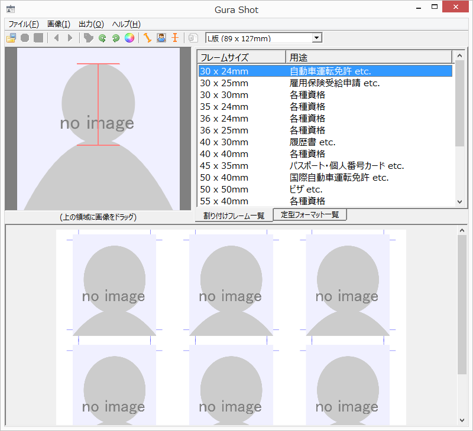
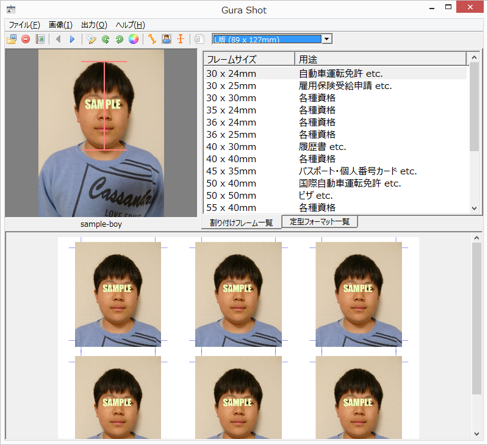

# おうちで証明写真 Gura Shot

## アプリケーションの紹介

免許証の申請やら履歴書やらで、証明写真がほしいときは意外と多いもの。
Gura Shot は、デジカメの画像から必要なサイズの証明写真をカンタンに作れるアプリケーションです。

* 自動車運転免許やパスポートの申請に必要なサイズの写真をつくれます。
* 顔の中心や上下の余白を適切に設定します。
* 斜めにかたむいた画像を補正する機能がついています。
* 画像履歴で開いた画像と抽出範囲を覚えているので、必要なときに呼び出して使えます。

## 動作環境

Windows が動作している PC を用意してください。Windows 7 で動作確認しています。それ以前のバージョン Windows XP、Vista でも大丈夫だと思いますが、Windows 8 は未確認です。

このアプリケーションを実行するには [Gura プログラミング言語](http://www.gura-lang.org/)
の環境が必要です。[ダウンロードページ](http://www.gura-lang.org/Download.html) から
Windows Installer (`gura-x.x.x-win32.msi`) をダウンロードし、インストールしてください。

また、Adobe Reader など PDF を閲覧できるソフトをインストールしておいてください。

## インストール

gurashot-1.0.0.zip をダウンロードして適当なフォルダに展開します。  
セットアップ用スクリプト `setup-gurashot.guraw` を実行すると、 デスクトップにアイコンを作成します。  
セットアップをしないで、ちょっと試してみたい場合は `gurashot.guraw` を実行してください。

## 簡単な使い方

Gura Shot を起動すると以下の画面になります。

左上の「顔抽出ウィンドウ」に画像ファイルをドラッグアンドドロップしてください。読み込むことができる画像フォーマットは JPEG、PNG、GIF、BMP です。

ツールバーの  ボタンと
 ボタンで画像を回転することができます。
「顔抽出ウィンドウ」で赤いカーソルを移動して、顔の中心、頭の上、あごの先をあわせます。
画面下部の「プレビューウィンドウ」に結果が表示されます。
必要な写真サイズを右上の「写真サイズリスト」から選択してください。

メインメニューから `[出力(O)] - [PDFビューア(V)...]` を実行すると
出力結果が PDF ビューア上に表示されます。

## くわしい使い方

フレーム表示

中心線表示

ななめ画像補正

用紙サイズ選択
用紙向き
用紙縦方向・用紙横方向・用紙方向自動設定

画像履歴管理
`[ファイル(F)] - [画像一覧表示(S)...]`
