免許証の申請やら履歴書やらで、証明写真がほしいときは意外と多いもの。
Gura Shot は、デジカメの画像から必要なサイズの証明写真をカンタンに作れる
アプリケーションです。

<table>
<tr>
<th>Windows 用

<a href="https://github.com/gura-app/{{ page.app_package }}/releases/download/v{{ page.app_version }}/{{ page.app_package }}-{{ page.app_version }}.zip"
  onClick="ga('send', 'event', 'download', 'click', '{{ page.app_package }}-{{ page.app_version }}.zip');">ダウンロード</a>
</th>
<th>Linux 用

<a href="https://github.com/gura-app/{{ page.app_package }}/releases/download/v{{ page.app_version }}/{{ page.app_package }}-{{ page.app_version }}.zip"
  onClick="ga('send', 'event', 'download', 'click', '{{ page.app_package }}-{{ page.app_version }}.zip');">ダウンロード</a>
</th>
<th>macOS 用

<a href="https://github.com/gura-app/{{ page.app_package }}/releases/download/v{{ page.app_version }}/{{ page.app_package }}-{{ page.app_version }}.dmg"
  onClick="ga('send', 'event', 'download', 'click', '{{ page.app_package }}-{{ page.app_version }}.dmg');">ダウンロード</a>
</th>
</tr>

<tr>
<td></td>
<td>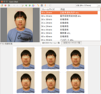</td>
<td>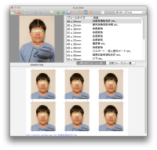</td>
</tr>

<tr>
<td><a href="#install-windows">インストール方法</a></td>
<td><a href="#install-linux">インストール方法</a></td>
<td><a href="#install-macos">インストール方法</a></td>
</tr>
</table>

* パスポート・個人番号カード・自動車運転免許などの申請に必要なサイズの写真をつくれます。
* 顔の中心と上下を指定すると、適切な余白をもたせた画像を生成します。パスポートや個人番号カード用の写真は
  [外務省の規格](http://www.mofa.go.jp/mofaj/toko/passport/ic_photo.html) に合うよう調整します。
* [画像切り出し機能](#trimming)を使うと、ワープロ文書への貼付や電子申請などに使えるイメージファイルが作成できます。
* 斜めにかたむいた画像を補正する[斜め補正機能](#tilt-adjust)がついています。
* [画像一覧](#image-list)で今までに開いた画像ファイルをすぐに呼び出せます。
* 結果を PDF で出力するので、正確な寸法で印刷できます。
* コンビニなどのプリントサービスを使い、正確な寸法で印刷できる
  [プリントサービス機能](#print-service)を持っています 。

- - - - - - - - - - - - - - - - - - - - - - - - - - - - - - - - - - - - - - - - - -

**紹介されたサイト・出版物**

* [窓の杜 レビュー](http://www.forest.impress.co.jp/docs/review/20140730_659980.html)
* [日経パソコン 2017 年 1 月 9 日号 (日経 BP) 「即効！フリーソフト便利帳」](http://store.nikkeibp.co.jp/item/backno/NP0761.html)
* [DOS/V Power Report 2017 年 3 月号 (Impress) 特別付録小冊子「窓の杜連動 人気オンラインソフト 100+」](http://www.dosv.jp)
* Windows 最強フリーソフト パーフェクトガイド 2017 (マイウェイ出版)
* [無料で Windows が快適になる鉄板フリーソフト 2017「窓の杜」公式 (Impress)](http://book.impress.co.jp/books/1116102062)

- - - - - - - - - - - - - - - - - - - - - - - - - - - - - - - - - - - - - - - - - -

**目次**

1. <a href="#basic-operation">基本的な使い方</a>
2. <a href="#trimming">画像切り出し機能</a>
3. <a href="#tilt-adjust">斜め補正機能</a>
4. <a href="#image-list">画像一覧</a>
5. <a href="#image-label">画像ラベル</a>
6. <a href="#color-adjust">色彩調整</a>
7. <a href="#defined-format">定型フォーマット機能</a>
8. <a href="#output">出力機能</a>
9. <a href="#print-service">プリントサービス機能</a>
10. <a href="#user-defined-frame">ユーザ定義割り付けフレーム</a>
11. <a href="#install-windows">インストール方法 - Windows</a>
12. <a href="#install-linux">インストール方法 - Linux</a>
13. <a href="#install-macos">インストール方法 - macOS</a>
14. <a href="#test-environment">動作確認環境</a>
15. <a href="#history">変更履歴</a>
16. <a href="#for-developers">開発者むけ情報</a>

## 1. 基本的な使い方

1. アプリケーションを起動すると以下のメインウィンドウが表示されます。

   

2. 左上の「顔抽出ウィンドウ」に画像ファイルをドラッグアンドドロップしてください。読み込むことができる画像フォーマットは JPEG、PNG、GIF、BMP です。

   メインメニューから `[画像(I)]-[左回転(L)]` または `[画像(I)]-[右回転(R)]`を実行するか、ツールバーの
    ボタンまたは
    ボタンをクリックすると画像を 90 度回転することができます。

   

   ドラッグアンドドロップ操作以外でも、
   メインメニューから `[ファイル(F)]-[画像を開く(O)...]` を実行するか、ツールバーの
    ボタンをクリックして
   画像ファイルを開くことができます。

3. 「顔抽出ウィンドウ」で赤いカーソルを移動して、顔の中心、頭の上、あごの先をあわせます。
   メインウィンドウ下部の「プレビューウィンドウ」に結果が表示されます。

   メインメニューから `[画像(I)]-[フレーム表示(F)]` を実行するか、ツールバーの
    ボタンをクリックすると、
   選択した写真サイズに対応する抽出範囲に応じて顔の周辺にフレームを表示します。

   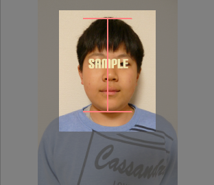

   また、メインメニューから `[画像(I)]-[中心ガイド(C)]` を実行するか、ツールバーの
    ボタンをクリックすると、
   カーソル中に中心ガイドを表示します。

4. 必要な写真サイズを右上の「割り付けフレーム一覧」から選択してください。
   また、印刷する用紙サイズをツールバー中の「用紙サイズコンボボックス」から選択します。

5. メインメニューから `[出力(O)]-[PDFビューア(V)...]` を実行すると PDF ファイルを作成し、
   そのファイルを PDF ビューアで開きます。
   
6. PDF ビューアの操作手順に従って印刷します。以下の点をご確認ください。

   * PDF ビューアとして Adobe Reader を使う場合、`「印刷」` ダイアログ中の
     `「ページサイズ処理」` を `[サイズ]` にし、`[実際のサイズ]` を選びます。
   * プリンタのプロパティが以下の設定になっていることを確認してください。  
     **用紙種類** &hellip; 写真用紙  
     **用紙サイズ** &hellip; 「用紙サイズコンボボックス」で設定したサイズ  
     **四辺フチなし** &hellip; チェックをはずす  

## 2. 画像切り出し機能

メインウィンドウ右上の「割り付けフレーム一覧」で「画像切り出し」を選択するとプレビューウィンドウが
以下のように表示され、切り出した顔画像をイメージファイルとして出力することができます。

プレビューには、切り出した結果のピクセルサイズが表示されます。

イメージをクリップボードにコピーするには、メインメニューから `[出力(O)]-[切り出し画像をコピー(C)]`
を実行します。

イメージをファイルに保存するには、メインメニューから `[出力(O)]-[切り出し画像を保存(S)...]` を実行します。

## 3. 斜め補正機能

メインメニューから `[画像(I)]-[傾き調整(T)]` を実行するか、ツールバーの
 ボタンをクリックすると、
斜め画像補正用のカーソルに切り替わります。
二つの白丸を動かして顔の中心と頭の上、あごの先をあわせてください。

## 4. 画像一覧

一度とりこんだ画像は、画像一覧に記録されます。

メインメニューから `[ファイル(F)]-[画像一覧表示(S)...]` を実行するか、ツールバーの
 ボタンをクリックすると、
画像一覧ダイアログが開きます。

画像を選択して `[選択]` ボタンをクリックするか、画像をダブルクリックすると、
「顔抽出ウィンドウ」にその画像をとりこみます。

右クリックメニューから `[削除(E)]` を実行するか、
`[Delete]` キーを押すと、選択した画像を一覧から画像をとりのぞくことができます。
もとのファイルは削除されません。

メインウィンドウからでも以下の操作で画像一覧中の画像を順次呼び出すことができます。

* メインメニューから `[ファイル(F)]-[前の画像(P)]` を実行するか、ツールバーの
   ボタンをクリックすると、
  画像一覧中の前の画像を呼び出します。
* メインメニューから `[ファイル(F)]-[次の画像(N)]` を実行するか、ツールバーの
   ボタンをクリックすると、
  画像一覧中の次の画像を呼び出します。
* 左カーソルキーで前の画像、右カーソルキーで次の画像を呼び出します。

## 5. 画像ラベル

開いた画像には画像ラベルがつけられています。
画像ラベルは「顔抽出ウィンドウ」の下や画像一覧に表示され、出力結果のタイトル中にも印刷されます。
とりこんだ時点ではファイル名を画像ラベルにしますが、以下の操作で編集することができます。

* メインメニューから `[画像(I)]-[ラベル名を変更(R)...]` を実行するか、ツールバーの
   ボタンをクリック
* 画像一覧ダイアログ中、画像下のラベルをクリックするか、
  右クリックメニューから `[ラベル名を変更(R)...]` を実行

画像ラベルを編集しても、元のファイルには影響しません。

分かりやすい画像ラベルをつけておくと、後々必要な画像を呼び出す際に便利です。

## 6. 色彩調整

開いた画像ごとに色彩の調整をすることができます。

メインメニューから `[画像(I)]-[色彩調整(A)...]` を実行するか、ツールバーの
 ボタンをクリックすると、
色彩調整ダイアログが開きます。

各要素の数値調節や色調の選択をした後、`[OK]` ボタンをクリックするとその調整結果が出力結果に反映されます。
変更を無効にする場合は　`[キャンセル]` ボタンを押してください。

各要素の `[リセット]` ボタンをクリックすると、ダイアログを開いた時点での調整値に戻ります。

イメージの色調を「カラー」「モノクロ」「セピア調」のうちから選択できます。
「セピア調」を選択すると、`[調整]` ボタンをクリックすることでセピア色として定義する色を編集することができます。

色彩調整をしても、元のファイルには影響しません。

## 7. 定型フォーマット機能

「定型フォーマット一覧」タブを選択すると、
写真のサイズや位置をレイアウトした定型フォーマットを使って結果を出力します。
定型フォーマットには以下のものが含まれます。

<table>

<tr><td valign="top">履歴書・自動車運転免許</td>
<td>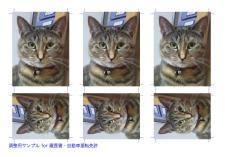</td></tr>

<tr><td valign="top">履歴書・雇用保険受給申請</td>
<td>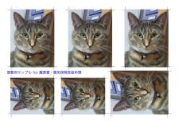</td></tr>

<tr><td valign="top">パスポート・自動車運転免許</td>
<td>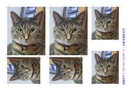</td></tr>

<tr><td valign="top">A-one プリンタラベル 29603/29613</td>
<td>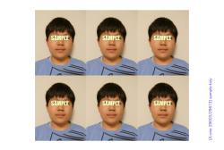</td></tr>

<tr><td valign="top">ヒサゴ 証明写真サイズシール CJ766S/CJ866NS</td>
<td>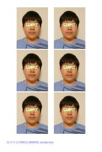</td></tr>

<tr><td valign="top">ヒサゴ 切手型シール CJ883S</td>
<td>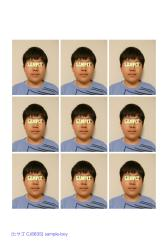</td></tr>

</table>

## 8. 出力機能

メインメニューから `[出力(O)]-[PDF出力(O)...]` を実行すると
指定したファイル名で PDF ファイルを出力します。

メインメニューから `[出力(O)]-[出力設定(O)...]` を実行するか、ツールバーの
 ボタンをクリックすると、
以下の出力設定ダイアログが開きます。

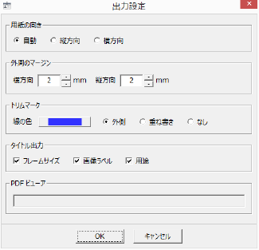

設定内容は以下の通りです。

* **用紙の向き** &hellip; デフォルトでは、写真をより多く収められる方向に用紙を設定しますが (自動)、
  常に縦方向または横方向に設定することができます。
* **外周のマージン** &hellip; 割り付けフレームの外周に設けるマージン量です。
* **トリムマーク** &hellip; 切り離し位置を表すトリムマークの線の色や、描画位置を設定します。
* **タイトル出力** &hellip; 印刷結果の左下に描画するタイトル内容を指定します。
* **PDF ビューア** &hellip; (Linux のみ) PDF ビューアの実行ファイル名を指定します。

## 9. プリントサービス機能

コンビニなどにあるプリントサービスを使うと、プリンタを持っていなくても
画像ファイルを写真用紙に印刷することができます。
しかし、これらのサービスでは写真用紙いっぱいに余白なしで印刷するために
画像の周辺を取り除いてしまいます。
どれだけの幅を取り除くかはプリントサービスに設置されているプリンタやマルチコピー機によって異なるので、
証明写真のように正確なサイズの写真がほしい場合は大きさの調整が難しくなります。

Gura Shot の「プリントサービス機能」は、出力画像の周辺に調整用ラインを描画し、
実際に印刷されたラインの数から取り除かれた幅を算出して、画像サイズを調整します。

用紙サイズを「L 版」に設定し、
メインメニューから `[出力(O)]-[プリントサービス(P)]` を実行すると、
以下のプリントサービスダイアログが開きます。

いくつかのプリントサービスについては、作者が独自に調査した結果をもとに作成した
調整用ライン情報が登録されています。「プリントサービス名」横の `[検索]` ボタンをクリックして、
使用するプリントサービスを選択してください。

以下は Gura Shot に登録されているプリントサービスの調整用ライン情報です。

<table>
<tr><th>プリントサービス</th><th>機種名</th><th>調整用ラインの数</th><th>印刷確認 (*)</th></tr>
<tr><td>サークル K サンクス</td><td>SHARP MX-4500DS</td><td>a = 11, b = 10, c = 7, d = 10</td><td>2014/06/30</td></tr>
<tr><td>スリーエフ</td><td>SHARP MX-4500DS</td><td>a = 11, b = 10, c = 8, d = 8</td><td>2014/06/30</td></tr>
<tr><td>セブンイレブン</td><td>Fuji Xerox (型番不明)</td><td>a = 10, b = 7, c = 7, d = 6</td><td>2014/06/30</td></tr>
<tr><td>ファミリーマート</td><td>SHARP MX-3610DS</td><td>a = 13, b = 12, c = 13, d = 12</td><td>2014/06/30</td></tr>
<tr><td>ローソン</td><td>SHARP MX-3610DS</td><td>a = 13, b = 12, c = 13, d = 12</td><td>2014/06/30</td></tr>
<tr><td>FOTOLUSIO PrintRush</td><td>DNP (型番不明)</td><td>a = 13, b = 14, c = 12, d = 13</td><td>2014/07/11</td></tr>
<tr><td>三菱カラープリント</td><td>三菱電機ミクプリ</td><td>a = 11, b = 10, c = 7, d = 10</td><td>2014/07/11</td></tr>
</table>

(*) この設定で、自動車運転免許用写真 (30 x 24mm) を 0.1mm 程度の誤差範囲内で印刷できることを確認しました。

`[出力]` ボタンをクリックすると、画像ファイルを出力します。

初めて使うプリントサービスについては、実際に印刷してみないと調整用ラインの数は分かりません。
最初は、ダイアログ中の各設定値を適当に設定して出力した画像ファイルを
プリントサービスで印刷します。
その結果を見て、長辺と短辺に沿って印刷された調整用ラインの数 a, b, c, d を入力します。
a と b、c と d は、それぞれ足した数が同じであれば同一の結果を出力します。
例えば a = 6, b = 10 の場合と a = 8, b = 8 の場合では同じ結果になります。

以下は、a, b, c, d をすべて 8 に設定して出力したサンプルです。
このサンプルの原寸イメージを印刷して調整用ラインの数を確認することもできます。

 [原寸イメージ](images/sample-adjust.jpg)

## 10. ユーザ定義割り付けフレーム

割り付けフレーム一覧中の「ユーザ定義 1」から「ユーザ定義 5」には
ユーザが独自にフレームサイズを設定することができます。

これらのエントリをダブルクリックすると以下の割り付けフレーム編集ダイアログが開きます。

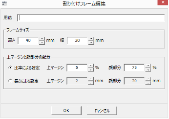

フレームサイズの高さと幅を設定します。

「上マージン」と「顔部分」にはそれぞれ顔の上に設けるマージン幅と顔部分の高さを設定します。
左のラジオボタンによって、比率による設定と長さによる設定のどちらかを選択できます。

## 11. インストール方法 - Windows

1. このアプリケーションを実行するには [Gura プログラミング言語](http://www.gura-lang.org/)
   の環境が必要です (無償)。
   Windows Installer `gura-x.x.x-win32.msi` (`x.x.x` はバージョン番号) を
   [ダウンロード](http://www.gura-lang.org/Download.html) し、
   インストールしてください。バージョン `0.5.1` 以降に対応しています。

   また、Adobe Reader など PDF を閲覧・印刷できるソフトをインストールしておいてください。

2. パッケージファイル `{{ page.app_package }}-{{ page.app_version }}.zip` を
  <a href="https://github.com/gura-app/{{ page.app_package }}/releases/download/v{{ page.app_version }}/{{ page.app_package }}-{{ page.app_version }}.zip"
  onClick="ga('send', 'event', 'download', 'click', '{{ page.app_package }}-{{ page.app_version }}.zip');">ダウンロード</a> して適当なフォルダに展開します。

3. 展開したファイル中から `setup.gura` をダブルクリックし「Gura アプリケーションセットアップ」を実行します。
   `[セットアップ]` ボタンをクリックするとデスクトップに起動用アイコンを作成します。
   セットアップをした後は、パッケージから展開したファイルを削除してもかまいません。

   「Gura アプリケーションセットアップ」の詳細については [こちら]({{ topdir }}/setup/) をご覧ください。

## 12. インストール方法 - Linux

1. このアプリケーションを実行するには [Gura プログラミング言語](http://www.gura-lang.org/)
   の環境が必要です (無償)。
   ソースパッケージ `gura-x.x.x-src.tar.gz` (`x.x.x` はバージョン番号) を
   [ダウンロード](http://www.gura-lang.org/Download.html) し、
   インストール手順に従って Gura 本体とモジュールをインストールしてください。
   バージョン `0.5.2` 以降に対応しています。

   また、PDF の閲覧・印刷をするソフトとして、Ubuntu にはデフォルトで evince が入っていますが、
   お好みで Adobe Reader などのソフトをインストールしておいてください。

2. パッケージファイル `{{ page.app_package }}-{{ page.app_version }}.zip` を
  <a href="https://github.com/gura-app/{{ page.app_package }}/releases/download/v{{ page.app_version }}/{{ page.app_package }}-{{ page.app_version }}.zip"
  onClick="ga('send', 'event', 'download', 'click', '{{ page.app_package }}-{{ page.app_version }}.zip');">ダウンロード</a> して適当なフォルダに展開します。

3. コマンドラインから以下のようにスクリプトファイル `gurashot.guraw` を実行するとプログラムが起動します。

        $ gura gurashot.guraw

## 13. インストール方法 - macOS

1. このアプリケーションを実行するには [Gura プログラミング言語](http://www.gura-lang.org/)
   の環境が必要です (無償)。
   macOS ディスクイメージ `gura-x.x.x.dmg` (`x.x.x` はバージョン番号) を
   [ダウンロード](http://www.gura-lang.org/Download.html) し、
   インストールしてください。バージョン `0.6.2` 以降に対応しています。

2. macOS ディスクイメージ `{{ page.app_package }}-{{ page.app_version }}.dmg` を
  <a href="https://github.com/gura-app/{{ page.app_package }}/releases/download/v{{ page.app_version }}/{{ page.app_package }}-{{ page.app_version }}.dmg"
  onClick="ga('send', 'event', 'download', 'click', '{{ page.app_package }}-{{ page.app_version }}.dmg');">ダウンロード</a> して開き、`Gura Shot.app` を `Applications` フォルダにドラッグします。

3. 初めて実行する場合は、Finder で `Gura Shot.app` を選択し、右クリックメニューで「開く」を実行してください。
   二度目以降は Launchpad から起動できます。

## 14. 動作確認環境

* **Windows** &hellip; Windows 7, Windows 8.1, Windows 10
* **Linux** &hellip; Ubuntu 13.10, Ubuntu 14.04, Xubuntu 14.04, Lubuntu 14.04
* **macOS** &hellip; Mavericks (10.9), Sierra (10.12)

## 15. 変更履歴

<table>
<tr><th>バージョン</th><th>リリース</th><th>変更内容</th></tr>

<tr><td>v1.4.2</td><td>2017/05/31</td><td>
Gura v0.7.0 に対応 
ファイル操作に関するエラー処理を追加 
キーボードショートカットを変更
</td></tr>

<tr><td>v1.4.0</td><td>2016/01/13</td><td>
画像切り出し機能を追加 
アイコンを変更
</td></tr>

<tr><td>v1.3.0</td><td>2014/08/04</td><td>
定型フォーマット出力機能を追加
</td></tr>

<tr><td>v1.2.1</td><td>2014/07/11</td><td>
PDF 出力時の用紙サイズを修正
</td></tr>

<tr><td>v1.2.0</td><td>2014/07/09</td><td>
Linux サポート 
EXIF 情報を読み込んで画像の向きを設定する機能を実装 
画像一覧で画像を削除した後、[閉じる] をクリックすると削除が反映されないバグを修正 
複数画像を一度に開けるようにした 
</td></tr>

<tr><td>v1.1.0</td><td>2014/07/03</td><td>
出力設定ダイアログを実装 
割り付けフレーム編集ダイアログを実装 
プリントサービス検索ダイアログを実装 
</td></tr>

<tr><td>v1.0.4</td><td>2014/06/30</td><td>
セピア色を編集可能にした 
プリントサービス機能を実装 
</td></tr>

<tr><td>v1.0.3</td><td>2014/06/27</td><td>
色彩調整ダイアログを実装 
抽出画像をクリップボードに保存する機能を実装 
抽出画像をファイルに保存する機能を実装 
</td></tr>

<tr><td>v1.0.2</td><td>2014/06/24</td><td>
パッケージに README を追加 
出力用紙サイズにはがきサイズを追加 
開いている画像が無い場合に画像一覧のメニューやボタンを無効化 
</td></tr>

<tr><td>v1.0.1</td><td>2014/06/20</td><td>
画面レイアウトを変更
</td></tr>

<tr><td>v1.0.0</td><td>2014/06/19</td><td>
1st リリース
</td></tr>

</table>

## 16. 開発者むけ情報

このアプリケーションは GitHub レポジトリで管理されています。

URL: [https://github.com/gura-app/gurashot.git](https://github.com/gura-app/gurashot.git)
