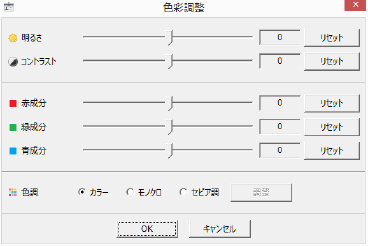
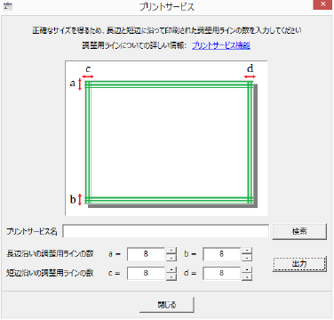



# {{ page.title }}

## 1. アプリケーションの紹介

免許証の申請やら履歴書やらで、証明写真がほしいときは意外と多いもの。
Gura Shot は、デジカメの画像から必要なサイズの証明写真をカンタンに作れる
アプリケーションです。

* 自動車運転免許やパスポートの申請に必要なサイズの写真をつくれます。
* 顔の中心や上下の余白を適切に設定します。パスポート用の写真は
  [外務省](http://www.mofa.go.jp/mofaj/index.html) の規格に合うよう調整します。
* 斜めにかたむいた画像を補正する機能がついています。
* 画像と編集内容の履歴を保持しているので、必要なときにさっと呼び出して使えます。
* 結果を PDF で出力するので、正確な寸法で印刷できます。
* コンビニなどのプリントサービスを使って、できるだけ正確な寸法で印刷できる機能を持っています。

## 2. 動作環境

Windows が動作している PC を用意してください。Windows 7 で動作確認しています。
それ以前のバージョン Windows XP、Vista でも大丈夫だと思いますが、Windows 8 は未確認です。

このアプリケーションを実行するには [Gura プログラミング言語](http://www.gura-lang.org/)
の環境が必要です (無償)。[ダウンロードページ](http://www.gura-lang.org/Download.html) から
Windows Installer (`gura-x.x.x-win32.msi`) をダウンロードし、インストールしてください。

また、Adobe Reader など PDF を閲覧できるソフトをインストールしておいてください。

## 3. インストール

パッケージファイル [gurashot-{{ app_version }}.zip](https://github.com/gura-app/gurashot/releases/download/v{{ app_version }}/gurashot-{{ app_version }}.zip)
をダウンロードして適当なフォルダに展開します。

エキスプローラなどでスクリプトファイル `gurashot.guraw` をダブルクリックするとプログラムが起動します。

デスクトップにアイコンを作りたい場合はスクリプトファイル `setup.guraw` を起動してください。
`[セットアップ]` ボタンをクリックするとセットアップを行います。
セットアップをした後は、パッケージから展開したファイルを削除してもかまいません。

セットアップの詳細については [Gura アプリケーションセットアップ](../setup/) をご覧ください。

## 4. 基本的な使い方

1. アプリケーションを起動すると以下のメイン画面が表示されます。

   

2. 左上の「顔抽出ウィンドウ」に画像ファイルをドラッグアンドドロップしてください。読み込むことができる画像フォーマットは JPEG、PNG、GIF、BMP です。

   メインメニューから `[画像(I)]-[左回転(L)]` または `[画像(I)]-[右回転(R)]`を実行するか、ツールバーの
    ボタンまたは
    ボタンをクリックすると画像を 90 度回転することができます。

   

   ドラッグアンドドロップ操作以外でも、
   メインメニューから `[ファイル(F)]-[画像を開く(O)...]` を実行するか、ツールバーの
    ボタンをクリックして
   画像ファイルを開くことができます。

4. 「顔抽出ウィンドウ」で赤いカーソルを移動して、顔の中心、頭の上、あごの先をあわせます。
   画面下部の「プレビューウィンドウ」に結果が表示されます。

   メインメニューから `[画像(I)]-[フレーム表示(F)]` を実行するか、ツールバーの
    ボタンをクリックすると、
   選択した写真サイズに対応する抽出範囲に応じて顔の周辺にフレームを表示します。

   

   また、メインメニューから `[画像(I)]-[中心ガイド(C)]` を実行するか、ツールバーの
    ボタンをクリックすると、
   カーソル中に中心ガイドを表示します。

5. 必要な写真サイズを右上の「写真サイズリスト」から選択してください。
   また、印刷する用紙サイズをツールバー中の「用紙サイズコンボボックス」から選択します。

6. メインメニューから `[出力(O)]-[PDFビューア(V)...]` を実行すると出力結果が PDF ビューア上に表示されます。
   プリンタのプロパティが以下の設定になっていることを確認してから印刷してください。
   * 用紙種類 ... 写真用紙
   * 用紙サイズ ... 「用紙サイズコンボボックス」で設定したサイズ
   * 四辺フチなし ... チェックをはずす

## 5. 斜め補正機能

メインメニューから `[画像(I)]-[傾き調整(T)]` を実行するか、ツールバーの
 ボタンをクリックすると、
ななめ画像補正用のカーソルに切り替わります。
白丸を動かして顔の中心と頭の上、あごの先をあわせてください。

## 6. 画像一覧

一度とりこんだ画像は、画像一覧に記録されます。

メインメニューから `[ファイル(F)]-[画像一覧表示(S)...]` を実行するか、ツールバーの
 ボタンをクリックすると、
画像一覧ダイアログが開きます。

画像を選択して `[選択]` ボタンをクリックするか、画像をダブルクリックすると、
「顔抽出ウィンドウ」にその画像をとりこみます。

右クリックメニューから `[削除(E)]` を実行するか、
`[Delete]` キーを押すと、選択した画像を一覧から画像をとりのぞくことができます。
もとのファイルは削除されません。

メイン画面からでも以下の操作で画像一覧中の画像を順次呼び出すことができます。

* メインメニューから `[ファイル(F)]-[前の画像(P)]` を実行するか、ツールバーの
   ボタンをクリックすると、
  画像一覧中の前の画像を呼び出します。
* メインメニューから `[ファイル(F)]-[次の画像(N)]` を実行するか、ツールバーの
   ボタンをクリックすると、
  画像一覧中の次の画像を呼び出します。

## 7. 画像ラベル

開いた画像には画像ラベルがつけられており、「顔抽出ウィンドウ」の下や画像一覧に表示されます。
とりこんだ時点ではファイル名を画像ラベルにしますが、以下の操作で編集することができます。

* メインメニューから `[画像(I)]-[ラベル名を変更(R)...]` を実行するか、ツールバーの
   ボタンをクリック
* 画像一覧ダイアログ中、画像下のラベルをクリックするか、
  右クリックメニューから `[ラベル名を変更(R)...]` を実行

画像ラベルを編集しても、元のファイルには影響しません。

分かりやすい画像ラベルをつけておくと、後々必要な画像を呼び出す際に便利です。

## 8. 色彩調整

開いた画像ごとに色彩の調整をすることができます。

メインメニューから `[画像(I)]-[色彩調整(A)...]` を実行するか、ツールバーの
 ボタンをクリックすると、
色彩調整ダイアログが開きます。

各要素の数値調節や色調の選択をした後、`[OK]` ボタンをクリックするとその調整結果が出力結果に反映されます。
変更を無効にする場合は　`[キャンセル]` ボタンを押してください。

各要素の `[リセット]` ボタンをクリックすると、ダイアログを開いた時点での調整値に戻ります。

イメージの色調を「カラー」「モノクロ」「セピア調」のうちから選択できます。
「セピア調」を選択すると、`[調整]` ボタンをクリックすることでセピア色として定義する色を編集することができます。

## 9. 出力機能

メインメニューから `[出力(O)]-[PDF出力(O)...]` を実行すると
指定したファイル名で PDF ファイルを出力します。

抽出した顔画像を他のアプリケーションなどで使いたいときは、
以下の操作でクリップボードやファイルに画像データを保存することができます。

* メインメニューから `[画像(I)]-[抽出画像をコピー(C)]` を実行すると
  抽出した顔画像をクリップボードにコピーします。
* メインメニューから `[画像(I)]-[抽出画像を保存(S)...]` を実行すると
  抽出した顔画像をファイルに保存します。

デフォルトでは、写真をより多く収められる方向に用紙を設定しますが、
以下の操作で縦または横に設定することができます。

* メインメニューから `[出力(O)]-[用紙縦方向(E)]` を実行するか、ツールバーの
   ボタンをクリックすると、
  用紙を縦方向にして写真を配列します。
* メインメニューから `[出力(O)]-[用紙横方向(H)]` を実行するか、ツールバーの
   ボタンをクリックすると、
  用紙を横方向にして写真を配列します。
* メインメニューから `[出力(O)]-[用紙方向自動設定(A)]` を実行するか、ツールバーの
   ボタンをクリックすると、
  写真をより多く収められる方向に用紙の向きを設定します。これがデフォルトです。

## 10. プリントサービス機能

コンビニなどにあるプリントサービスを使うと、画像ファイルを写真用紙に印刷することができます。
でも、これらのサービスでは写真用紙いっぱいに余白なしで印刷するために
画像の周辺を取り除いてしまいます。
どれだけの幅を取り除くかはプリントサービスに設置されているプリンタやマルチコピー機によって異なるので、
証明写真のように正確なサイズの写真がほしい場合は大きさの調整が難しくなります。

Gura Shot の「プリントサービス機能」は、出力画像の周辺に調整用ラインを描画し、
実際に印刷されたラインの数からできるかぎり正確なサイズを算出します。

用紙サイズを「L 版」に設定し、
メインメニューから `[出力(O)]-[プリントサービス(P)]` を実行すると、
以下のプリントサービスダイアログが開きます。

`[出力]` ボタンをクリックすると、画像ファイルを出力します。

実際に印刷してみないと調整用ラインの数は分かりません。
最初は、ダイアログ中の各設定値を適当に設定して出力した画像ファイルを
プリントサービスで印刷します。
その結果を見て、長辺と短辺に沿って印刷された調整用ラインの数 a, b, c, d を入力します。
a と b、c と d は、それぞれ足した数が同じであれば同一の結果を出力します。
例えば a = 6, b = 10 の場合と a = 8, b = 8 の場合では同じ結果になります。

以下は、a, b, c, d をすべて 8 に設定して出力したサンプルです。
[この画像ファイル](images/sample-adjust.jpg) を印刷して調整用ラインの数を確認することもできます。

作者が近所のコンビニで上の画像を印刷し、その結果から得られた調整用ラインの数を以下にまとめます。
参考にしてください。

<table>
<tr><th>コンビニ名</th><th>機種名</th><th>調整用ラインの数</th></tr>
<tr><td>サークル K サンクス</td><td>SHARP MX-4500DS</td><td>a = 11, b = 10, c = 7, d = 10</td></tr>
<tr><td>スリーエフ</td><td>SHARP MX-4500DS</td><td>a = 11, b = 10, c = 8, d = 8</td></tr>
<tr><td>セブンイレブン</td><td>Fuji Xerox (型番不明)</td><td>a = 10, b = 7, c = 7, d = 6</td></tr>
<tr><td>ファミリーマート</td><td>SHARP MX-3610DS</td><td>a = 13, b = 12, c = 13, d = 12</td></tr>
<tr><td>ローソン</td><td>SHARP MX-3610DS</td><td>a = 13, b = 12, c = 13, d = 12</td></tr>
</table>

*この設定で、自動車運転免許用写真 (30 x 24mm) を 0.1mm 程度の誤差範囲内で印刷できることを確認しました (2014/06/30)。*

## 11. 変更履歴

<table>
<tr><th>バージョン</th><th>リリース</th><th>変更内容</th></tr>

<tr><td>v1.0.4</td><td>2014/06/30</td><td>
セピア色を編集可能にした 
プリントサービス機能を実装 
</td></tr>

<tr><td>v1.0.3</td><td>2014/06/27</td><td>
色彩調整ダイアログを実装 
抽出画像をクリップボードに保存する機能を実装 
抽出画像をファイルに保存する機能を実装 
</td></tr>

<tr><td>v1.0.2</td><td>2014/06/24</td><td>
パッケージに README を追加 
出力用紙サイズにはがきサイズを追加 
開いている画像が無い場合に画像一覧のメニューやボタンを無効化 
</td></tr>

<tr><td>v1.0.1</td><td>2014/06/20</td><td>
画面レイアウトを変更
</td></tr>

<tr><td>v1.0.0</td><td>2014/06/19</td><td>
1st リリース
</td></tr>

</table>

## 12. 開発者むけ情報

このアプリケーションは GitHub レポジトリで管理されています。
以下のコマンドでレポジトリを取得することができます。

    git clone https://github.com/gura-app/gurashot.git
