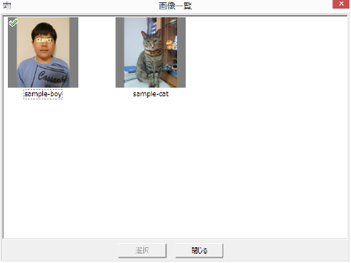

# {{ page.title }}

## アプリケーションの紹介

免許証の申請やら履歴書やらで、証明写真がほしいときは意外と多いもの。
Gura Shot は、デジカメの画像から必要なサイズの証明写真をカンタンに作れるアプリケーションです。

* 自動車運転免許やパスポートの申請に必要なサイズの写真をつくれます。
* 顔の中心や上下の余白を適切に設定します。パスポート用の写真は
  [外務省](http://www.mofa.go.jp/mofaj/index.html) の規格に合うよう調整します。
* 斜めにかたむいた画像を補正する機能がついています。
* 開いた画像と抽出範囲を覚えているので、必要なときにさっと呼び出して使えます。

## 動作環境

Windows が動作している PC を用意してください。Windows 7 で動作確認しています。それ以前のバージョン Windows XP、Vista でも大丈夫だと思いますが、Windows 8 は未確認です。

このアプリケーションを実行するには [Gura プログラミング言語](http://www.gura-lang.org/)
の環境が必要です。[ダウンロードページ](http://www.gura-lang.org/Download.html) から
Windows Installer (`gura-x.x.x-win32.msi`) をダウンロードし、インストールしてください。

また、Adobe Reader など PDF を閲覧できるソフトをインストールしておいてください。

## インストール

パッケージファイル [gurashot-1.0.0.zip](https://github.com/gura-app/gurashot/releases/download/v1.0.0/gurashot-1.0.0.zip)
をダウンロードして適当なフォルダに展開します。

エキスプローラなどでスクリプトファイル `gurashot.guraw` をダブルクリックするとプログラムが起動します。

デスクトップにアイコンを作りたい場合はスクリプトファイル `setup.guraw` を起動してください。
`[セットアップ]` ボタンをクリックするとセットアップを行います。

## 簡単な使い方

アプリケーションを起動すると以下の画面になります。

左上の「顔抽出ウィンドウ」に画像ファイルをドラッグアンドドロップしてください。読み込むことができる画像フォーマットは JPEG、PNG、GIF、BMP です。

ツールバーの  ボタンと
 ボタンで画像を回転することができます。
「顔抽出ウィンドウ」で赤いカーソルを移動して、顔の中心、頭の上、あごの先をあわせます。
画面下部の「プレビューウィンドウ」に結果が表示されます。
必要な写真サイズを右上の「写真サイズリスト」から選択してください。

メインメニューから `[出力(O)]-[PDFビューア(V)...]` を実行すると
出力結果が PDF ビューア上に表示されます。

## 斜め補正機能

メインメニューから `[画像(I)]-[傾き調整(T)]` を実行するか、ツールバーの
 ボタンをクリックすると、
ななめ画像補正用のカーソルに切り替わります。
白丸を動かして顔の中心と頭の上、あごの先をあわせてください。

## 画像一覧

一度とりこんだ画像は、画像一覧に記録されます。

メインメニューから `[ファイル(F)]-[画像一覧表示(S)...]` を実行するか、ツールバーの
 ボタンをクリックすると、
画像一覧のダイアログが開きます。

画像を選択して `[選択]` ボタンをクリックすると、「顔抽出ウィンドウ」にその画像をとりこみます。

右クリックメニューから `[ラベル名を変更(R)]` を実行するか、
ラベルをクリックすると、選択した画像のラベル名を編集することができます。

右クリックメニューから `[削除(E)]` を実行するか、
`[Delete]` キーを押すと、選択した画像を一覧から画像をとりのぞくことができます。
もとのファイルは削除されません。

## その他の機能

* メインメニューから `[ファイル(F)]-[前の画像(P)]` を実行するか、ツールバーの
   ボタンをクリックすると、
  画像一覧中の前の画像を呼び出します。
* メインメニューから `[ファイル(F)]-[次の画像(N)]` を実行するか、ツールバーの
   ボタンをクリックすると、
  画像一覧中の次の画像を呼び出します。
* メインメニューから `[画像(I)]-[フレーム表示(F)]` を実行するか、ツールバーの
   ボタンをクリックすると、
  選択した顔の周辺にフレームを表示します。
*  メインメニューから `[画像(I)]-[中心ガイド(C)]` を実行するか、ツールバーの
   ボタンをクリックすると、
  カーソル中に中心ガイドを表示します。
* メインメニューから `[出力(O)]-[用紙縦方向(E)]` を実行するか、ツールバーの
   ボタンをクリックすると、
  用紙を縦方向にして写真を配列します。
* メインメニューから `[出力(O)]-[用紙横方向(H)]` を実行するか、ツールバーの
   ボタンをクリックすると、
  用紙を横方向にして写真を配列します。
* メインメニューから `[出力(O)]-[用紙方向自動設定(A)]` を実行するか、ツールバーの
   ボタンをクリックすると、
  写真をより多く配列できる方向に用紙の向きを設定します。
* ツールバー中の用紙サイズ選択コンボボックスから用紙サイズを選択します。
  対応している用紙サイズは以下のとおりです。
<table>
<tr><th>用紙サイズ</th><th>寸法</th></tr>
<tr><td>L 版</td><td>89 x 127mm</td></tr>
<tr><td>KG 版</td><td>102 x 152mm</td></tr>
<tr><td>2L 版</td><td>127 x 178mm</td></tr>
<tr><td>A4</td><td>210 x 297mm</td></tr>
<tr><td>A3</td><td>297 x 420mm</td></tr>
<tr><td>六切り</td><td>203 x 254mm</td></tr>
<tr><td>四切り</td><td>254 x 305mm</td></tr>
</table>

## 開発者むけ情報

このアプリケーションは GitHub レポジトリで管理されています。
以下のコマンドでレポジトリを取得することができます。

    git clone https://github.com/gura-app/gurashot.git
