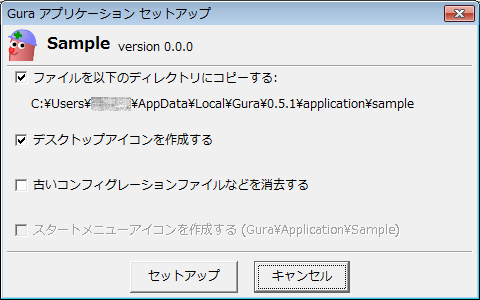

# {{ page.title }}

パッケージに同梱されているセットアップスクリプト `setup.guraw` を起動すると
以下のウィンドウが表示されます。

`[セットアップ]` ボタンをクリックすると処理を実行します。

以下のチェックボックスでセットアップの内容を設定することができます。

* 「ファイルを以下のディレクトリにコピーする:」をチェックすると、
  表示したディレクトリに必要なファイルをコピーします。
  セットアップ後は、パッケージを展開したファイル群を削除することができます。  
  このチェックを外すと、パッケージを展開したディレクトリが
  そのままセットアップディレクトリになります。
* 「デスクトップアイコンを作成する」をチェックすると、デスクトップにアイコンを作成します。
* 「古いコンフィグレーションファイルなどを消去する」をチェックすると、
  以前に作成したコンフィグレーションファイルなどの設定ファイルを削除します。
  アプリケーションのバージョンを上げる際、古いコンフィグレーションが原因で
  不具合が発生したときなどにこれを有効にします。

